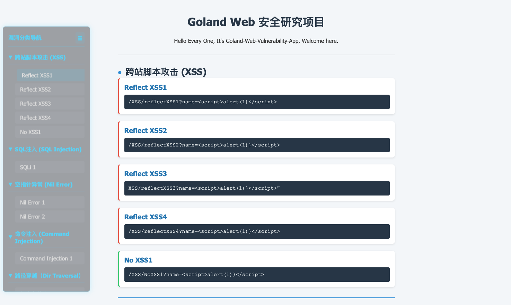

# Golang Web靶场


---

## 项目部署
下载项目后执行如下命令：
```shell
git clone https://github.com/bigblackhat/GoVulnWebApp.git GoVulnWebApp
cd GoVulnWebApp
go build -o server
./server
```
访问地址：http://127.0.0.1:8080 进入靶场。

也可以指定启动端口：`./server -port=8081`。

### 演示

项目启动：
```shell
leo:~/GoVulnWebApp (main *%) $ ./server
Go-Web, Listening on port: 8080

       _==/          i     i          \==_
     /XX/            |\___/|            \XX\
   /XXXX\            |XXXXX|            /XXXX\
  |XXXXXX\_         _XXXXXXX_         _/XXXXXX|
 XXXXXXXXXXXxxxxxxxXXXXXXXXXXXxxxxxxxXXXXXXXXXXX
|XXXXXXXXXXXXXXXXXXXXXXXXXXXXXXXXXXXXXXXXXXXXXXX|
XXXXXXXXXXXXXXXXXXXXXXXXXXXXXXXXXXXXXXXXXXXXXXXXX
|XXXXXXXXXXXXXXXXXXXXXXXXXXXXXXXXXXXXXXXXXXXXXXX|
 XXXXXX/^^^^"\XXXXXXXXXXXXXXXXXXXXX/^^^^^\XXXXXX
  |XXX|       \XXX/^^\XXXXX/^^\XXX/       |XXX|
    \XX\       \X/    \XXX/    \X/       /XX/
       "\       "      \X/      "      /"
------------------------------------------------

Server is running...
Visit: http://localhost:8080
```

界面展示：



## Todo

- [x] 反射型XSS
- [ ] 存储型XSS
- [x] SQL注入
- [ ] 二次SQL注入
- [x] 空指针异常
- [x] 命令注入
- [x] 任意文件读取、写、删除、上传
- [x] 服务端请求伪造（SSRF）
- [x] 服务端模板注入（SSTI）
- [ ] 越权，未授权等
- [ ] 应用Gin框架


## version log

### v1.2
* 更新index.html
* 增加SSTI、SSRF
* 优化服务器启动相关逻辑
### v1.1
* 增加路径穿越类漏洞（任意文件操作）
* 增加index.html界面
### v1.0
* 基础漏洞类型：XSS、SQL注入、空指针异常、命令注入


## Thanks

感谢 @[大白哥](https://github.com/1derian) 提供的诸多idea，在他的帮助下，该项目得以丰富更多的漏洞类型