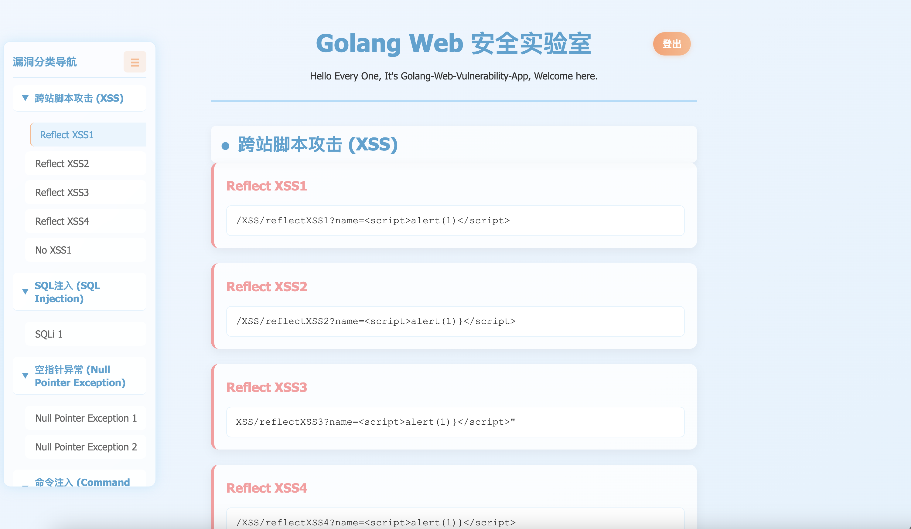

# Golang Web靶场


---

## 项目部署
下载项目后执行如下命令：
```shell
go build
./GolandWeb
```
访问地址：http://127.0.0.1:8080

演示：



## Todo

- [ ] 应用Gin框架
- [x] 任意文件读取、写、删、上传
- [ ] SSRF
- [ ] 服务端模板注入（SSTI）
- [ ] 越权，未授权等


## version log

### v1.1
* 增加路径穿越类漏洞（任意文件操作）
* 增加index.html界面
### v1.0
* 基础漏洞类型：XSS、SQL注入、空指针异常、命令注入